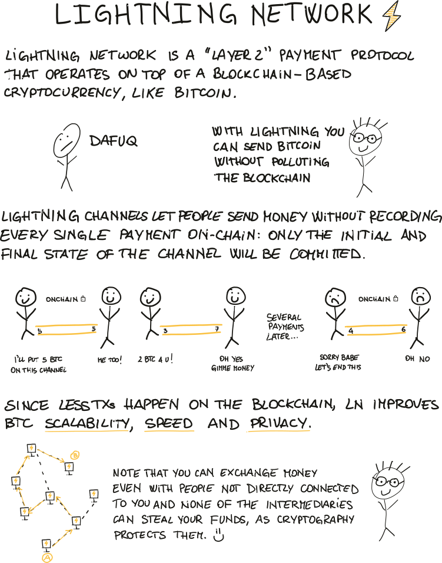
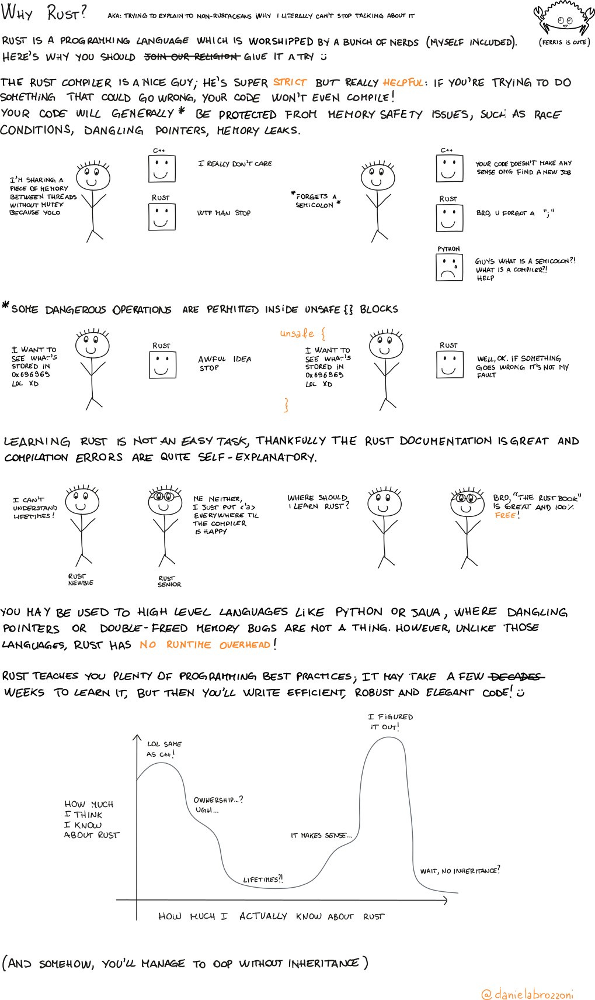

# random-zines

A collection of random zines I drew.

## Bitcoin legacy addresses

Yo, this was my first zine published. It sucks and I really hate the palette I used.

## Lightning network

## Why Rust?

As Peter Todd stated [here](https://twitter.com/peterktodd/status/1277246288258629633?s=20), technically inheritance in Rust exists, it is just achieved in different ways than e.g. Java, and this confused me at first (and I'm quite sure I'm not the only one!).

Still, Rust proves that there's no need to have structs which inherit from other structs to write objected oriented code :)
